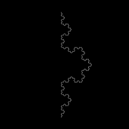
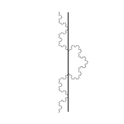
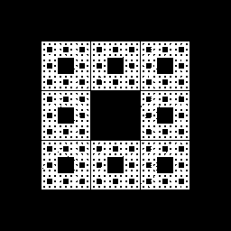
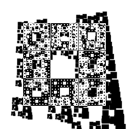
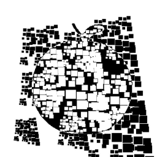

# Differentiable Fractal Rendering
A differentiable rendering and optimization pipeline for IFS fractals, written in PyTorch. 

The goal of this repo is to perform fractal image compression, by finding Iterated Function System (IFS) fractals whose attractor approximates a specific image. 

Here are some examples of this process in action. The middle column shows a diff of the image-in-process and the original image over the course of the training process.

| Original Image | Optimization GIF | Final Fractal Image |
| -------- | -------- | -------- |
|  |  |  |
|  |  |  |
|  |  |  |
|  |  |  |

Fractal image compression is really well-studied; to my knowledge this codebase represents the first attempt to do fractal compression via gradient descent. 

https://en.wikipedia.org/wiki/Fractal_compression

https://en.wikipedia.org/wiki/Iterated_function_system

To run this on your own files, you should work off one of the [NAME]_setup.py files. You'll also need a binary image file [NAME].png that is white where you want the fractal to be and black otherwise. 

The main script is train_ifs.py, which can be run like

python train_ifs.py [NAME]

This script will expect to same intermediate image files in a folder named results/[NAME].

It will also periodically produce a checkpoint of the fractal's parameters in a file [NAME].pt.

See diff_ifs.yaml for python dependencies and associated version numbers. 

Once you have found a configuration that is reasonably low-error, then you can render a high-res version of it with

python render_ifs.py [NAME] [RECURSION] [RESOLUTION]

where [RECURSION] is how many levels of recursion to use in the rendering and [RESOLUTION] is the size of the image to render. 
